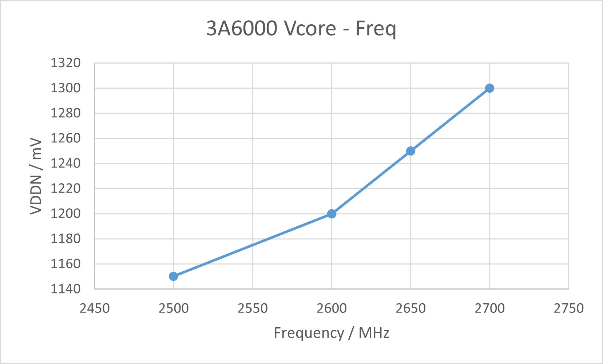
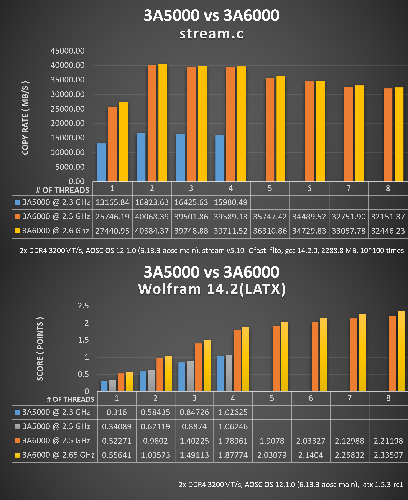
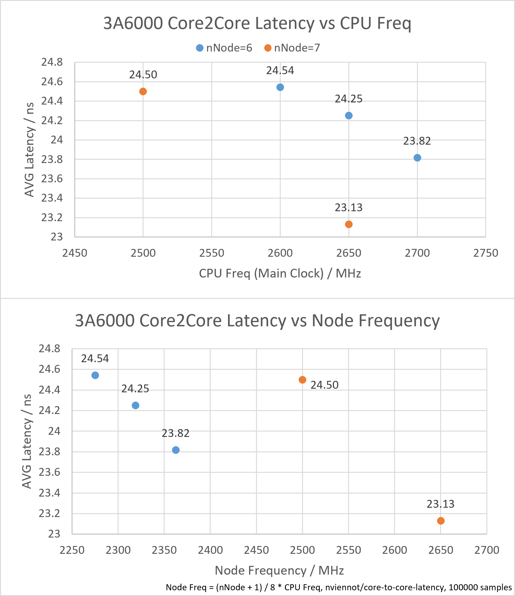
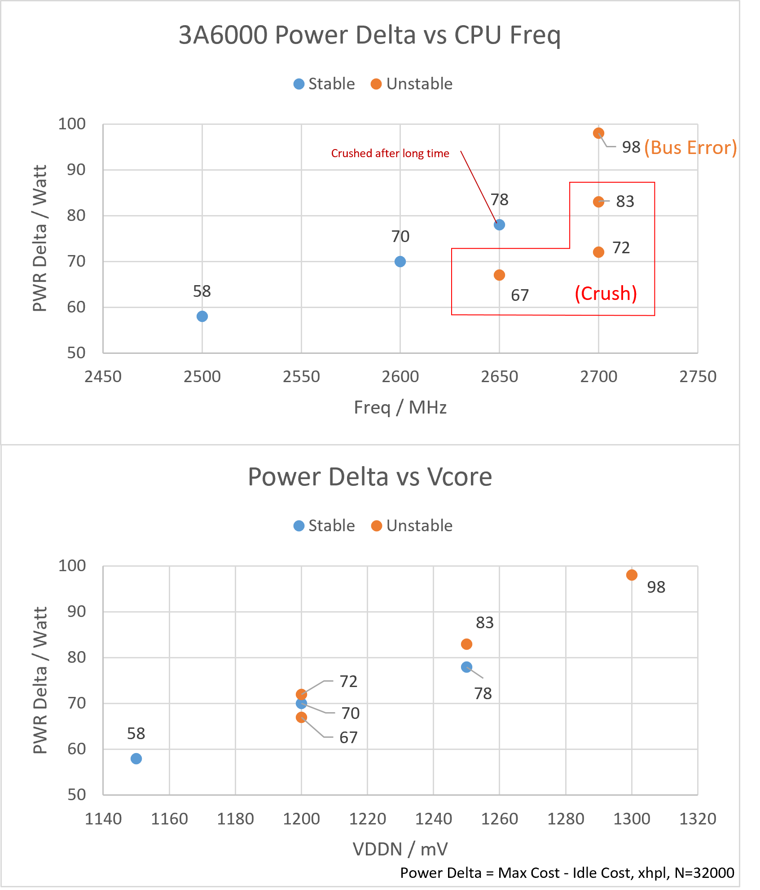

# 3A6000-XA612A0-Overclock
3A6000-7A2000 Demo board XA612A0 Overclocking BIOS and notes on them. Will be updated as latest officil firmware released. 

# Explanations 
Todo... 

# Benchmarks 

## 核心电压曲线 / Vcore curve

  

## stream.c and Mathematica(LATX)

  

## 核间延迟变化 / Core to core latency various

  

## 功耗增量 / Power comsunption increasements

  

